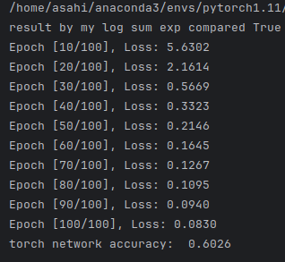

# 函数拟合——报告

**1. 函数定义**

我定义了一个函数 `my_log_sum_exp(_x)`，用于计算输入数组 `_x` 中每个元素的对数和指数。
$$
f(x)=log(\sum_{n=1}^N(e^{x_n}))
$$
该函数的实现是基于对 `NumPy `数组的操作，首先对输入数组进行指数运算，然后对结果进行求和，最后取对数。

------

**2. 数据采集**

我们生成了训练集和验证集，用于训练和评估神经网络模型的拟合效果。训练集和验证集都是随机生成的，具有指定的维度和长度，分别占整个训练集的0.8和0.2。

训练集用于训练神经网络模型，验证集用于评估模型在未见过的数据上的表现。

------

**3. 模型描述**

我构建了一个两层的` ReLU `网络模型，用于拟合给定的函数。这个模型由一个输入层、一个隐藏层和一个输出层组成。输入层的大小为 10，对应于训练集中的样本维度；隐藏层的大小为 16，输出层的大小为 1，对应于模型的输出特征维度。隐藏层和输出层之间使用 `ReLU `激活函数进行非线性变换。

------

**4. 拟合效果**

我首先通过对输入数据进行自定义函数 `my_log_sum_exp(_x)` 的计算，与使用` PyTorch` 内置函数 `torch.logsumexp()` 计算的结果进行对比，验证了我们自定义函数的正确性。

然后，我们将训练集输入到我们构建的神经网络模型中进行训练，使用梯度下降优化算法更新网络参数。训练过程中，我们打印了每个周期的损失值，以监控模型的训练情况。

最后，我们使用验证集评估了训练好的神经网络模型在未见过的数据上的拟合效果，计算了模型的准确率。

------

通过以上步骤，我们完成了对任意函数的神经网络模拟、训练和评估过程，并得到了模型在未见过数据上的拟合效果。
