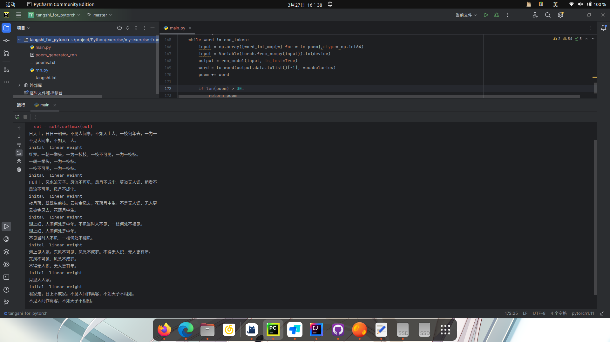

# 2152050-饶稷-课后作业4

## 1. `RNN`，`LSTM`和`GRU`模型的解释：

- `RNN`（循环神经网络）：
  
  - `RNN`是一种用于处理序列数据的神经网络结构，它的特点是可以利用前面的信息来影响后面的输出，通过将上一个时间步的输出作为当前时间步的输入，来建立时间依赖关系。
    $$
    h(t)=f(h_{t-1}, x_t)
    $$
    $$h_t$$被称为活性值。
  
  - 优点：短期记忆能力
  
  - 缺点：易梯度消失，模型只有一部分神经元学习到知识。
  
- `LSTM`（长短期记忆网络）：
  
  - `LSTM`是一种特殊的`RNN`变体，专门设计用来解决传统`RNN`中的梯度消失或梯度爆炸问题。，引入了门控机制，包括输入门、遗忘门和输出门，通过这些门控单元可以选择性地记忆或遗忘信息。
    $$
    i_t=\sigma(W_ix_t+U_ih_{t-1}+b_i)\\
    f_t=\sigma(W_fx_t+U_fh_{t-1}+b_f)\\
    o_t=\sigma(W_ox_t+U_oh_{t-1}+b_o)
    $$
    $$\sigma(·)$$​门不是离散的，是logistic回归
    $$
    c_t=\underbrace{f_t\odot c_{t-1}}_{之前信息有遗忘}+\underbrace{i_t\odot \widetilde{c_{t}}}_{当前信息}\\
    h_t(短期记忆)=\underbrace{o_t\odot tanh(c_{t})}_{只记得输出的内容}
    $$
  
  - 优点：更有效地处理长序列，捕捉长期的时间依赖关系。
  
- `GRU`（门控循环单元）：
  
  - `GRU`也是一种解决`RNN`梯度消失问题的变体，与`LSTM`相比，它简化了门控结构，减少了参数数量（不用计算短期记忆h）。包括更新门和重置门，通过这些门控单元来控制信息的流动和更新。
    $$
    \widetilde{h}_t=tanh(\underbrace{W_hx_t+U_h(\underbrace{r_t\odot h_{t-1}}_{0或U_hh_{t-1}})+b_h}_{LSTM中的\widetilde{c}_t简化版})\\
    h_t=z_t\odot h_{t-1}+(1-z_t)\odot \widetilde{h}_t(耦合LSTM中的输出和遗忘)
    $$
    
  - 优点：减少了参数量和计算量。

## 2. 诗歌生成过程的叙述：

这个诗歌生成模型的过程分为以下几个步骤：

1. 数据预处理：
   - 从文本文件中读取诗歌数据，并进行预处理，包括去除特殊字符、按照规定长度筛选诗歌等。
   - 统计诗歌中的字词，包括词跟词频，将词与词频分开到不同的元素列表中，并建立字词与索引之间的映射关系。
2. 模型搭建：
   - 构建了一个基于RNN的诗歌生成模型，包括词嵌入层、LSTM层和全连接层。
   - 使用词嵌入层将词汇编码为向量表示，然后经过LSTM层进行序列建模，最后通过全连接层输出词汇的概率分布。
3. 模型训练：
   - 使用预处理的诗歌数据对模型进行训练，训练过程中采用了RMSprop与Adam优化器和负对数似然损失函数。
   - 训练过程中，模型根据输入的诗歌片段，预测下一个字词的概率分布，并与真实的下一个字词进行比较，计算损失并进行梯度更新。
4. 诗歌生成：
   - 训练完成后，可以使用训练好的模型生成诗歌。
   - 首先指定一个开始字词，然后通过模型不断预测下一个字词，直到生成结束符号为止。
   - 生成过程中，模型每次预测的下一个字词都会作为输入的一部分，用于下一次预测，从而逐步生成整段诗歌。
5. 结果输出：
   - 对生成的诗歌进行美化处理。

## 3. 生成结果：

## 4. 总结

这次作业属于异步的序列到序列工作，输入为唐诗序列，输出也是序列，但长度不等。
